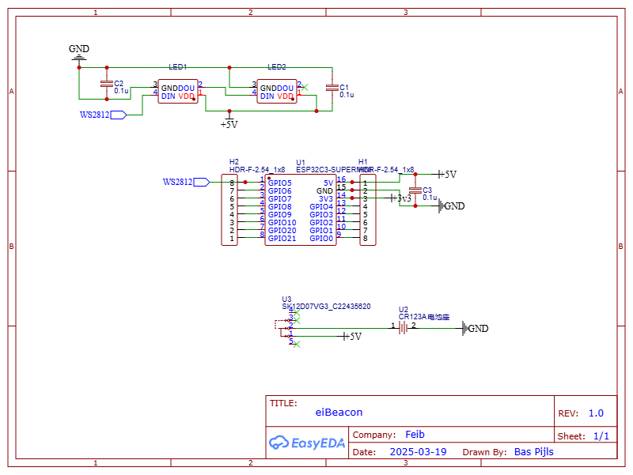
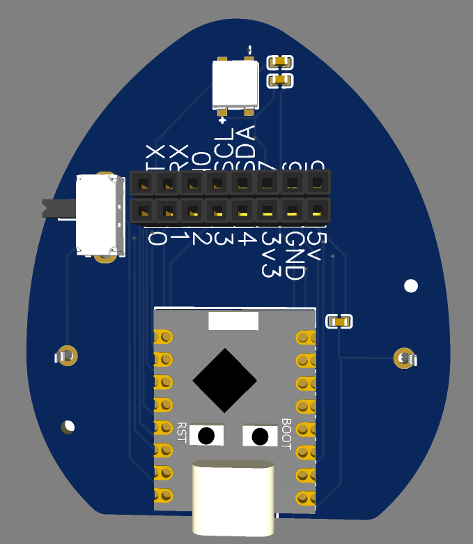
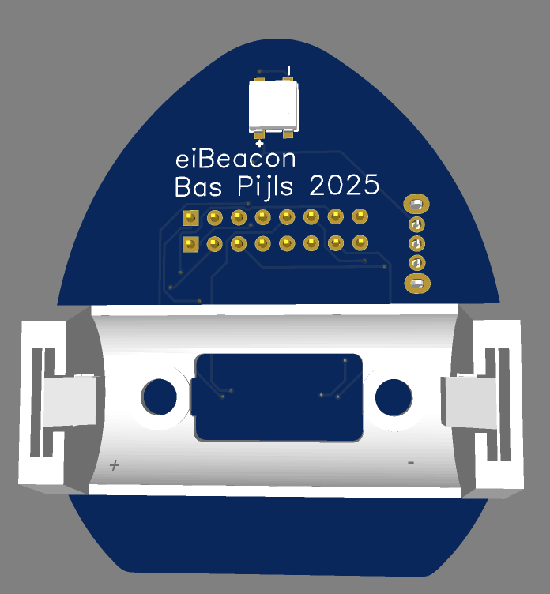
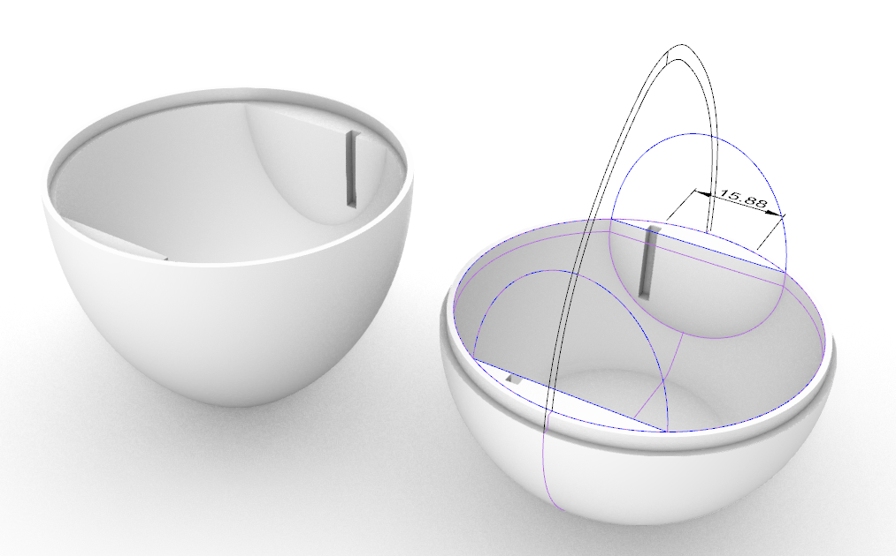
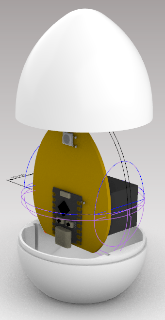

# eiBeacon

An iBeacon in the shape of an egg.

## Parts

- ESP32C3 Super Mini Module
- 1x Cr123A Battery Holder
- 1x Cr123A Battery
- 1x switch
- 2x ws2812b 5050 RGB LED
- 1x 3D Printed Egg Top
- 1x 3D Printed Egg Base

## PCB

||
|-|
|eiBeacon Schematic|

|||
|-|-|
|eiBeacon PCB top|eiBeacon PCB Bottom|

## Firmware

The firmware is based on the iBeacon example in the ESP32 Arduino core.

- When the `boot` pin is pressed after reset, the device will enter a mode where it is possible to enter the beacon name and the beacon UUID on the serial port.
- The device flashes it's LED every 60 seconds. It cycles through 6 colors.

## Enclosure

The enclosure is drawn in rhino and can be printed in 2 parts.

!!! note "Print with support"

    Support is needed for the bottom of both parts. Support for the inside of the shell can be turned off.

|||
|-|-|
|egg shell parts|egg shell PCB slot|

A slot is cut into both shells in order to keep the pcb in place.

!!! note "PCB slot"

    Pleas align the slots when closing the shell so the PCB is kept in place.